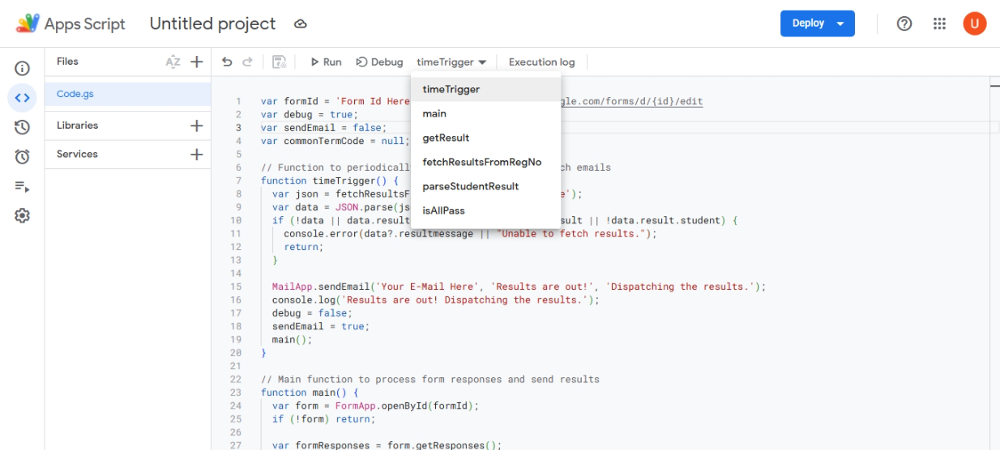
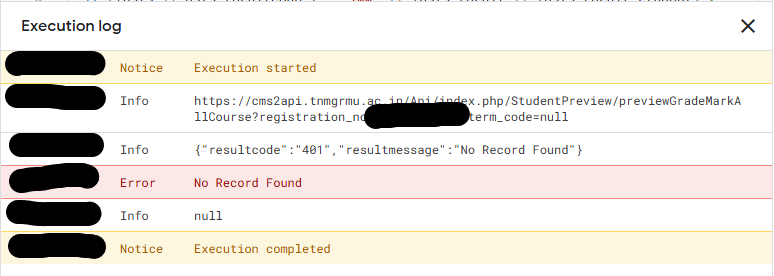

# Automating TNGMRMU Exam Result Distribution Using Google Forms and Apps Script

This guide demonstrates how to create a Google Form to collect email addresses and TNMGRMU registration numbers, and automate the process of fetching and distributing exam results using Google Apps Script.

> [!IMPORTANT]
> This method is optimized for a single course and semester. Ensure all form entries belong to the same course and semester. For multiple courses or semesters, create separate forms to avoid errors.

> **Note:** This guide is not affiliated with TNMGRMU.

---

## Step 1: Setting Up the Google Form

1. Open [Google Forms](https://forms.google.com).
2. Create a new form and add the following question:
    - **Registration Number**: Use the "Short Answer" question type and mark it as **Required**.

    

3. Navigate to the **Settings** tab, then to the **Responses** section, and enable **"Collect email addresses"** (set to `Verified`).
4. Ensure **"Limit to 1 response"** is enabled.

    

---

## Step 2: Writing the Apps Script

1. Open the Google Form and click the three dots in the top-right corner.
2. Select **"Apps Script"** to open the code editor in a new tab.

    

3. Replace the existing code the following code into the editor:

    ```javascript
    var formId = 'Form Id Here'; // Eg: https://docs.google.com/forms/d/{id}/edit
    var debug = true;
    var sendEmail = false;
    var commonTermCode = null;

    // Function to periodically check results and dispatch emails
    function timeTrigger() {
      var json = fetchResultsFromRegNo('Valid Reg.No Here');
      var data = JSON.parse(json);
      if (!data || data.resultcode !== '200' || !data.result || !data.result.student) {
        console.error(data?.resultmessage || "Unable to fetch results.");
        return;
      }

      MailApp.sendEmail('Your E-Mail Here', 'Results are out!', 'Dispatching the results.');
      console.log('Results are out! Dispatching the results.');
      debug = false;
      sendEmail = true;
      main();
    }

    // Main function to process form responses and send results
    function main() {
      var form = FormApp.openById(formId);
      if (!form) return;

      var formResponses = form.getResponses();
      for (var i = 0; i < formResponses.length; i++) {
        var formResponse = formResponses[i];
        var itemResponses = formResponse.getItemResponses();
        var regNo = itemResponses[0].getResponse();
        var email = formResponse.getRespondentEmail();

        if (!regNo) continue;
        var result = getResult(regNo);
        if (debug) console.log(result);

        if (result && sendEmail && email) {
          console.log(`${regNo}: ${email}`);
          MailApp.sendEmail(email, 'TNMGRMU Final Year Results (Unofficial)', result, { name: 'Automated Script' });
        }
        if (debug) return;
      }
    }

    // Fetches and parses results for a given registration number
    function getResult(regNo) {
      try {
        var json = fetchResultsFromRegNo(regNo);
        var data = JSON.parse(json);
        if (data.resultcode !== '200' || !data.result || !data.result.student) {
          console.error(data.resultmessage);
          return null;
        }

        return parseStudentResult(data);
      } catch (error) {
        console.error(`Error in 'getResult()' for registration number ${regNo}: ${error.message}`);
        return null;
      }
    }

    // Fetches results from the TNMGRMU API
    function fetchResultsFromRegNo(regNo) {
      try {
        var resultUrlBase = `https://cms2api.tnmgrmu.ac.in/Api/index.php/StudentPreview/previewGradeMarkAllCourse?registration_no=${regNo}&term_code=`;

        if (!commonTermCode) {
          var loginUrl = `https://cms2api.tnmgrmu.ac.in/Api/index.php/Login/appLogin?registration_no=${regNo}&login_type=result`;
          var loadCourseUrlBase = `https://cms2api.tnmgrmu.ac.in/Api/index.php/Login/loadCourseTerm?registration_no=${regNo}&exam_session=`;

          var loginResponse = UrlFetchApp.fetch(loginUrl).getContentText();
          var loginData = JSON.parse(loginResponse);
          if (loginData.resultcode === '200') {
            var examSession = loginData.result.exam_session;
            if (examSession) {
              var loadCourseUrl = `${loadCourseUrlBase}${encodeURIComponent(examSession)}`;
              var courseResponse = UrlFetchApp.fetch(loadCourseUrl).getContentText();
              var courseData = JSON.parse(courseResponse);
              if (courseData.resultcode === '200' && courseData.result.length > 0) {
                commonTermCode = courseData.result[0].course_term;
              }
            }
          }
        }

        var resultUrl = `${resultUrlBase}${encodeURIComponent(commonTermCode)}`;
        if (debug) console.log(resultUrl);
        var json = UrlFetchApp.fetch(resultUrl).getContentText();
        if (debug) console.log(json);
        return json;
      } catch (error) {
        console.error(`Error in 'fetchResultsFromRegNo()' for registration number ${regNo}: ${error.message}`);
        return null;
      }
    }

    // Parses the student result data into a readable format
    function parseStudentResult(data) {
      var allPass = isAllPass(data) ? ' (All Pass)' : ' :(';
      var resultString = `Final Year Exam Results${allPass}\n\n`;

      data.result.student.forEach(student => {
        resultString += `Name: ${student.student_name}\n`;
        resultString += `Registration No: ${student.registration_no}\n`;

        student.subject.forEach(subject => {
          resultString += `${subject.subject_name}: ${subject.result}\n`;
          subject.paper.forEach(paper => {
            resultString += `    • ${paper.paper_name}: ${paper.obtained_mark}\n`;
          });
        });
      });

      return resultString;
    }

    // Checks if all subjects are passed
    function isAllPass(data) {
      if (!data.result || !data.result.student) return false;

      return data.result.student.every(student =>
        student.subject.every(subject => subject.result.toLowerCase() === 'pass')
      );
    }
    ```
4. Replace `formId` with your **form's ID**, and provide a valid registration number and email address in the `timeTrigger` function and click **Save project to Drive**.

---

## Step 3: Testing the Workflow

1. Submit a response in the Google Form.
2. Set `debug` and `sendEmail` to `true` in the script to test the `main()` function.
3. Select `main` from the dropdown in the Apps Script editor and click **Debug**.

    

4. Check the **Execution log** for results.
5. If `sendEmail` is enabled, verify that the email was sent successfully.
6. If results are not yet available, the log will display `No Record Found`.

    

---

## Step 4: Automating the Process

1. Click the **Triggers** button (clock icon).

    

2. Add a new trigger and select the `timeTrigger` function.
3. Set the event source to **Time-driven** and configure the desired time interval.
4. Save the trigger. The script will now run automatically based on the configured schedule.

    

---

## Disclaimer

This guide is for **educational purposes only**. Ensure compliance with all applicable laws and regulations when using this script. Unauthorized use of data may result in legal consequences. Always obtain proper consent before collecting or processing personal information.

This guide is **not affiliated with TNMGRMU**.